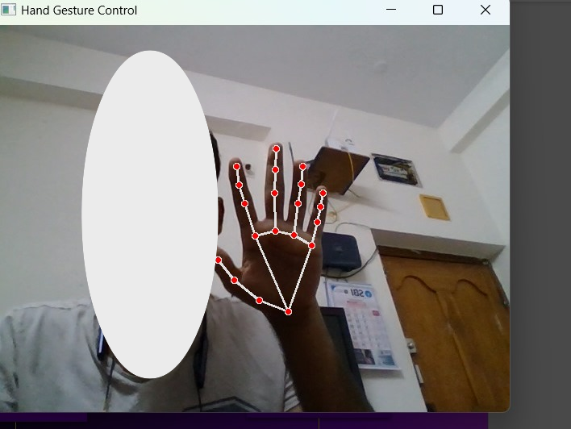
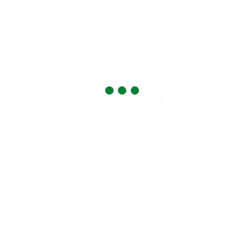

Not an expert yet, just Annie learning and coding- one day , my projects will be worth sharing i guess

## Projects

### Hand Gestures Code

This project involves recognizing hand gestures using computer vision techniques. It showcases your skills in image processing and machine learning.

### Web Chat Application

<picture>
  <source media="(prefers-color-scheme: dark)" srcset="./images/Projects/web-chat.png">
  <source media="(prefers-color-scheme: light)" srcset="./images/Projects/web-chat-light.png">
  
</picture>

This project is a real-time web chat application built with modern web technologies. It demonstrates your proficiency in web development and real-time communication.

## Contact

- **Email:** annieangel2936@gmail.com
- **GitHub:** [My Github Account](https://github.com/Annie2936)
- **Instagram:** [My Instagram Account](https://www.instagram.com/annieeee_029/)

## Github Stats

<picture>
  <source media="(prefers-color-scheme: dark)" srcset="https://github-readme-stats.vercel.app/api?username=Annie2936&theme=github_dark&show_icons=true&hide_border=true&include_all_commits=true#">
  <source media="(prefers-color-scheme: light)" srcset="https://github-readme-stats.vercel.app/api?username=Annie2936&theme=gruvbox_light&show_icons=true&hide_border=true&include_all_commits=true#gh">
  
</picture>

<picture>
  <source media="(prefers-color-scheme: dark)" srcset="https://github-readme-stats.vercel.app/api/top-langs/?username=Annie2936&theme=holi&layout=donut&size_weight=0.5&count_weight=0.5&langs_count=20&hide_border=true#gh-dark-mode-only">
  <source media="(prefers-color-scheme: light)" srcset="https://github-readme-stats.vercel.app/api/top-langs/?username=Annie2936&theme=vue&layout=donut&size_weight=0.5&count_weight=0.5&langs_count=20&hide_border=true#gh-light-mode-only">
  
</picture>

## GitHub Streak Stats

<picture>
  <source media="(prefers-color-scheme: dark)" srcset="https://github-readme-streak-stats.herokuapp.com?user=kareem1207&theme=midnight-purple&hide_border=true&date_format=M%20j%5B%2C%20Y%5D">
  <source media="(prefers-color-scheme: light)" srcset="https://github-readme-streak-stats.herokuapp.com?user=kareem1207&theme=flag-india&hide_border=true&date_format=M%20j%5B%2C%20Y%5D">
  
</picture>

## 🏆 GitHub Trophies

  

## 🐍 Contribution Graph

<picture>
  <source media="(prefers-color-scheme: dark)" srcset="https://raw.githubusercontent.com/kareem1207/kareem1207/output/github-snake-dark.svg" />
  <source media="(prefers-color-scheme: light)" srcset="https://raw.githubusercontent.com/kareem1207/kareem1207/output/github-snake.svg" />
  
</picture>

## Github Top Repos

  <a href ="https://github.com/Annie2936/Modular-Solver" >
<picture>
  <source media="(prefers-color-scheme: dark)" srcset="https://github-readme-stats.vercel.app/api/pin/?username=Annie2936&theme=cobalt2&repo=Modular-Solver&hide_border=true">
  <source media="(prefers-color-scheme: light)" srcset="https://github-readme-stats.vercel.app/api/pin/?username=Annie2936&theme=graywhite &repo=Modular-Solver&hide_border=false">
  
</picture>
  </a>
  <a href ="https://github.com/Annie2936/Decimal-to-binary" >
<picture>
  <source media="(prefers-color-scheme: dark)" srcset="https://github-readme-stats.vercel.app/api/pin/?username=Annie2936&theme=apprentice&repo=Decimal-to-binary&hide_border=true">
  <source media="(prefers-color-scheme: light)" srcset="https://github-readme-stats.vercel.app/api/pin/?username=Annie2936&theme=swift &repo=Decimal-to-binary&hide_border=false">
  
</picture>
  </a>
  <a href ="https://github.com/Annie2936/Silent-Auction" >
<picture>
  <source media="(prefers-color-scheme: dark)" srcset="https://github-readme-stats.vercel.app/api/pin/?username=Annie2936&theme=one_dark_pro&repo=Silent-Auction&hide_border=true">
  <source media="(prefers-color-scheme: light)" srcset="https://github-readme-stats.vercel.app/api/pin/?username=Annie2936&theme=swift&repo=Silent-Auction&hide_border=false">
  
</picture>
</a>
  <a href ="https://github.com/Annie2936/Page-Replacement-Technique-in-python" >
<picture>
  <source media="(prefers-color-scheme: dark)" srcset="https://github-readme-stats.vercel.app/api/pin/?username=Annie2936&theme=codeSTACKr&repo=Page-Replacement-Technique-in-python&hide_border=true">
  <source media="(prefers-color-scheme: light)" srcset="https://github-readme-stats.vercel.app/api/pin/?username=Annie2936&theme=solarized-light&repo=Page-Replacement-Technique-in-python&hide_border=false">
  
</picture>
  </a>

## Skills

### Programming Languages

## Achievements

- **Achievement One:** Acquired 3rd rank in Project Expo conducted by MGIT.

## Hobbies

- **Hobby One:** Learning new things.
- **Hobby Two:** Watching disney movies.
- **Hobby Three:** Painting and singing.
